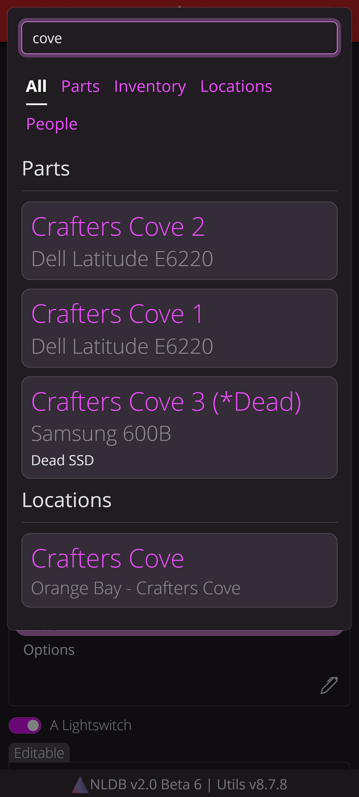
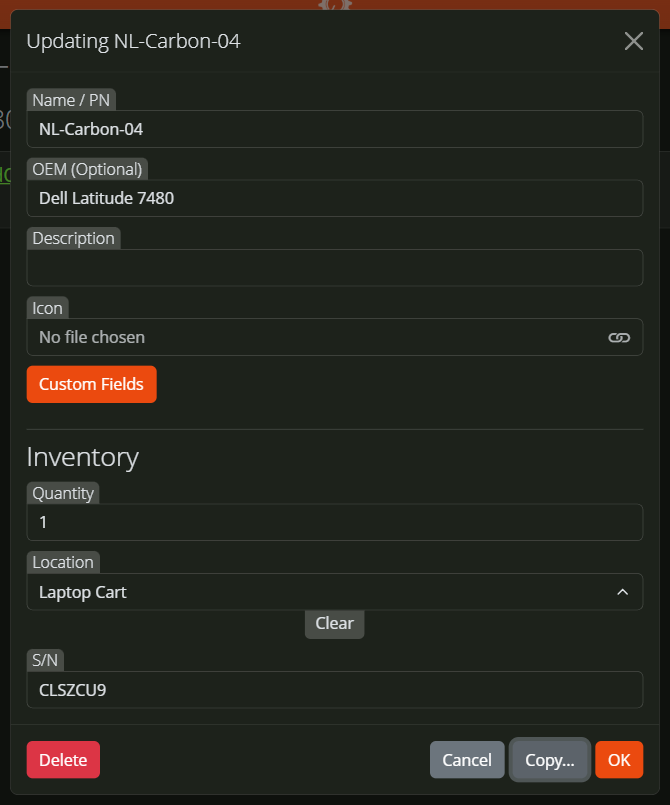
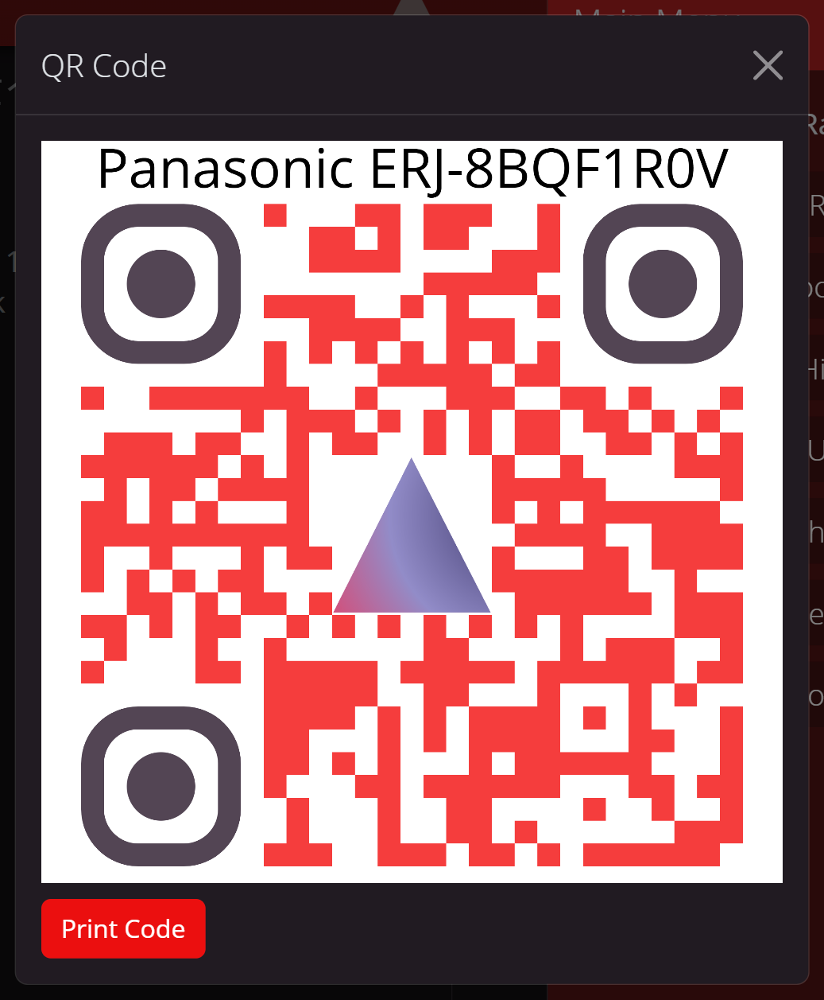

# NLDB
NLDB is a highly flexible, multi-user database/inventory management software built on a modern, desktop & mobile friendly web platform (HTML5, Node.js, MongoDB). It enables tracking taggable tools & assets, parts, consumables, and just about anything else!

# Features
NLDB works with both the **Unique Inventory** data model *(best for tracking unique, high-value assets, like PCs)* and the **Parts & Stock** data model *(best for tracking inventory, POs, and BOMs)*, and with support for multiple independent databases plus a granular user permissions system, it can unify all your tracking needs into one easy-to-use, high performance, and crucially, easily backed up open-source solution!

### 🧘 Relaxed view

### 🗂️ Detailed list view w/ custom sort

### 🌎 Hierarchical location tree

### ✨ Customizable theme, logo, and branding

### 📱 Works great on mobile

### 🚀 High-performance universal search

### 📅 Custom data fields & form inputs

### 🧲 Easy Duplicate & Bulk Operations

### 📜 History Log & Auditing

### 👥 Granular user permissions & multi-database support

### 📷 Scannable QR codes for tracking

### 🧪 Extendable API

More details on API usage & examples to come soon.

# Installation
The easiest way to get started with NLDB is via Docker. After installing Docker and the Compose extension, clone the repo and run `bash run.sh`. The environment should be set up automatically. A default *config.json* will also be generated. Basic settings can be edited here, however the port should be left at 8080. Change this instead in *compose.yaml* under `services.app.ports` (edit the number on the left side of the `:`).

In *compose.yaml* under `services.app.volumes`, you'll find entries for *key* and *cert*. Change `/dev/null` to the path to your private key and public certificate for HTTPS. If you're using Lets Encrypt, this will be `/etc/ssl/<site name>/privkey.pem` and `/etc/ssl/<site name>/fullchain.pem`. If you don't wish to use HTTPS, set *sslKey* and *sslCert* in *config.json* to empty strings.

You can also configure NLDB manually outside of a container. You'll need a recent version of Node.js (at least v22). CD into `app` , install dependencies with `npm i`, then run with `node server`. Edit *config.json* and set *dbUri* as appropriate to connect to your MongoDB instance.

# First Time Setup
Once NLDB is running, visit it in a browser. For now, there's no fancy setup wizard. Simply create an account, then open the menu and choose Settings. By default, anyone can make an account freely, though only the first account defaults to full admin access. You probably don't want this, so you'll want to either enable Invite Codes (for now, these are one-time-use), or change the Email Domain setting, which limits the emails with which users may create accounts to your organization's domain.

<!--
## Key Controls
#### Everywhere:
`Home` = Index/Search\
`Alt` or `ContextMenu` = Toggle Edit Mode\
`CTRL` = Usage Help (General help and tips + controls) -- **TODO**\
`Escape` = Go Back

#### In Menu:
`Escape` = Close Menu

#### Edit Mode:
`Insert` = Add Item\
`Escape` = Cancel Edit Mode

#### When Dragging or Renaming:
`Enter` = Confirm Name Edit\
`Escape` = Cancel Drag/Edit

## User Auth Levels
- `0` General user
- `1` View rights for category info (TBD: Is this useful without edit perms?)
- `2` Edit rights for cat, sub-cat, and items
- `3` Admin, create new categories
-->